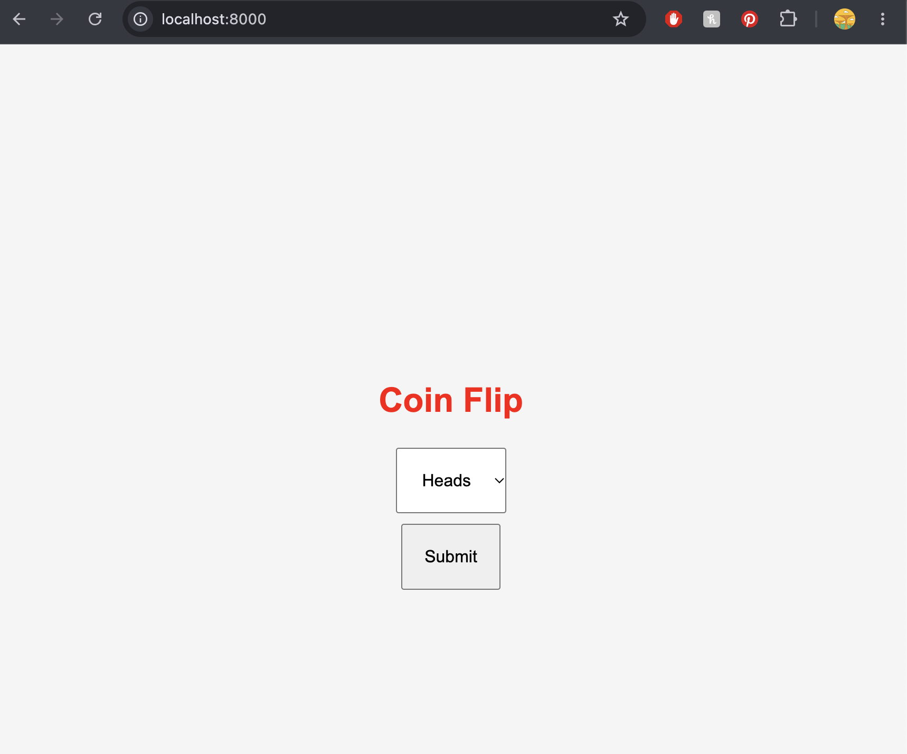
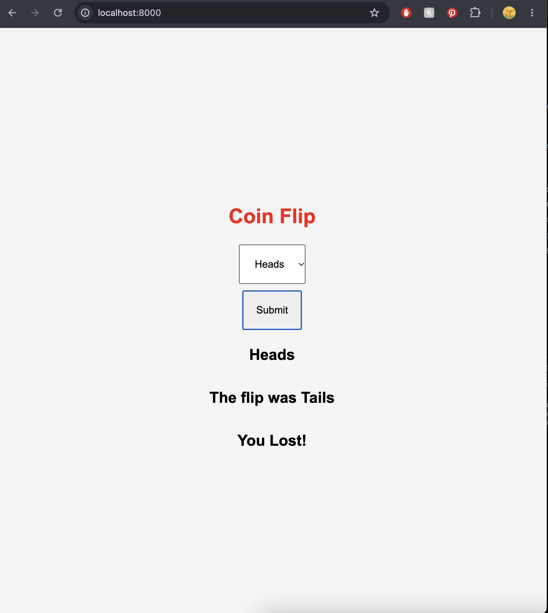

# 💸 Node Coin Flip Game 💸 

### Goal

Create a simple web application that uses the `fs` and `http` modules. Use `http` to create the server and `fs` to read the HTML file. Include vanilla ES6 JavaScript and create a coin flip guessing game.

### Images

  
  

### How to Play

1. Choose **Heads** or **Tails**.
2. Click the **Play** button.
3. The server randomly flips the coin.
4. See whether your guess matches the result.
5. Win if your guess is correct!

### Technologies Used

- HTML
- CSS
- JavaScript
- Node.js
- `http` module
- `fs` module
